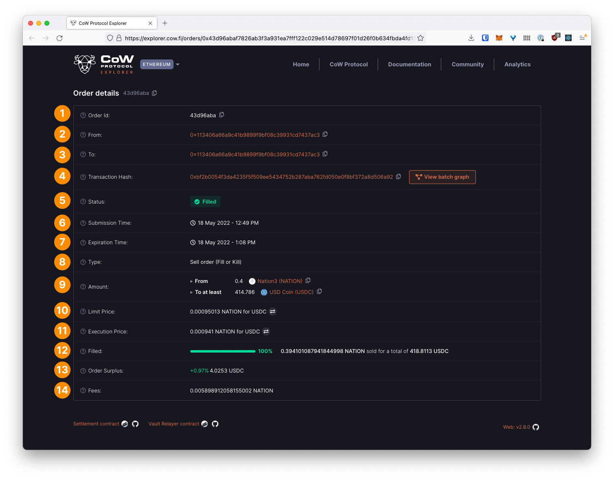

# CoW Explorer

CoW Protocol Explorer is an "Etherscan" like interface for the CoW Protocol. Given that CoW Protocol leverages meta transactions, aka signed/offchain orders, the transactions submitted by the users are completely offline/off-chain and are therefore not visible on-chain until they have been fully executed. Because of it, the Explorer exists to help users find their orders, and be informed about the order details and their state.

1. **Order ID:** ID given to each submitted order.
2. **From:** Ethereum address that is selling the tokens.
3. **To:** Ethereum address that is receiving the tokens.
4. **Transaction Hash:** Transaction hash of the order (Note that this parameter will only be shown once the order status is "Filled".
5. **Status:** State in which the order is at.
6. **Submission Time:** Time in which the order was submitted.
7. **Expiration Time:** Time in which the order will expire and no longer be valid.
8. **Type:** Type of order placed.
9. **Amount:** Specific Amounts that are to be traded.
10. **Limit Price:** Minimum price that the protocol guarantees the user.
11. **Execution price:** Price at which the order has been executed. This value can not be lower than the limit price.
12. **Filled:** Percentage of the order that the protocol has been able to execute.
13. **Order Surplus:** In the event of the protocol finding a better price than the user's limit price, order surplus quantifies in percentage and tokens how much more the user got above the asked amount.
14. **Fees:** Amount of fees that have been paid by the user.

#### States

As CPE is meant to help users visualize meta transactions (signed orders), a critical parameter to show is the State of the signed order. This parameter has the following status:

* **Open** (pending)**:** State for a standing order. Orders in this state are being considered by the solvers. It is the entry state for all orders, the default from the moment the order is placed. From here the order can transition to all other states
* **Filled:** State for an executed/settled order. Orders in this state have been executed and the corresponding funds transferred to the target account. Orders in this state will have available a link to the corresponding Etherscan settlement transaction. This settlement transaction would contain your order's execution and any other orders that are part of the same batch.
* **Expired:** State for orders that have not been executed. Orders in this state have not been executed during the defined expiration time (20 min by default).
* **Cancelled:** State for orders that have been cancelled. Orders in this state have been cancelled as per user request.

#### Surplus

All the Orders placed on CoW Protocol are essentially limit orders behind the scenes. When a user signs an order to trade it accepts the following:

* the sell and buy tokens they want to trade,
* the minimum price they are willing to receive,
* the slippage tolerance they have,
* the fee that is taken by the protocol and,
* how long is the order valid for.

Through Batch Auctions and CoWs (Coincidence of Wants), the protocol can improve on the minimum price that has been shown to the user. That improvement is called _"Surplus"_, and it measures how much better your actual trade price was as opposed to your original limit order price.

#### Prices

As mentioned before, CoW Protocol has the capability of offering users a better price than the limit price that they signed their orders with. Therefore, CoW Protocol has two different prices to take into account, these are:

* **Limit price:** The price set when the order was placed (minus the slippage) & signed. This is the minimum price that you will receive.
* **Execution price:** The actual price the order was executed at. This parameter can only be equal to or better than the limit price.

#### Search

In order to facilitate users searching their orders, the explorer has search functionality that allows the user to search for an order by the order id.

CPE is capable of detecting which network the order belongs to, redirecting and loading the order details for the appropriate network, given that it exists.
